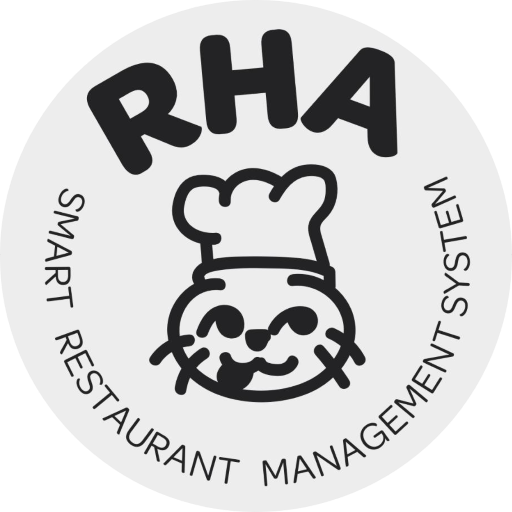

# RHA Restaurant Management System

<div align="center">
  
  
  **RHA Smart Restaurant Management System**
  
  A comprehensive database-driven solution for managing restaurant operations including reservations, orders, menu items, employees, and payments.
</div>

---

## Table of Contents

- [About the Project](#about-the-project)
- [Features](#features)
- [System Demonstration](#system-demonstration)
- [Database Schema](#database-schema)
- [Getting Started](#getting-started)
- [Database Setup](#database-setup)
- [Usage Examples](#usage-examples)
- [Advanced Features (SQL)](#advanced-features-sql)
- [Sample Data](#sample-data)
- [Project Structure](#project-structure)
- [Technologies Used](#technologies-used)
- [License](#license)

---

## About the Project

RHA (Restaurant Management System) is a complete database solution designed for a restaurants. The system manages all aspects of restaurant operations from table reservations to order processing, employee management, and payment tracking.

Used Sample has these Restaurant Details:

Name: RHA\n
Location: King Fahd Road, Riyadh 12271, Saudi Arabia\n
Cuisine: Japanese (Sushi, Sashimi, Teppanyaki)\n
Contact: +966-11-456-7890\n

---

## System Demonstration


<div align="center">
  <a href="https://youtu.be/PJOC-DjIrJE">
    
  </a>
</div>


---

## Features

### Core Functionality
- **Table Management:** Track table availability, status, and reservations across multiple floors
- **Menu Management:** Comprehensive menu system with categories, pricing, and availability tracking
- **Order Processing:** Complete order workflow from placement to payment
- **Reservation System:** Customer reservation management with status tracking
- **Employee Management:** Employee hierarchy with roles and supervisor relationships
- **Payment Processing:** Multiple payment methods (Credit Card, Mada, Cash, Apple Pay, STC Pay)
- **User Management:** Separate customer and employee user types

### Advanced Features
- **Price Change Logging:** Automatic tracking of menu item price changes via triggers
- **Tax Calculation:** Built-in tax calculation function (10%)
- **Custom Procedures:** Stored procedures for common operations
- **Views:** Pre-built views for order summaries and reporting
- **Referential Integrity:** Comprehensive foreign key relationships with cascade operations

---

## Database Schema

### Core Tables

#### 1. Restaurant
Stores restaurant information
- RestaurantID (PK)
- Name, Street, City, ZipCode, PhoneNumber

#### 2. Restaurant_Table
Manages restaurant seating
- TableNumber (PK)
- Status (Available, Occupied, Reserved, Maintenance)
- Floor, Section, Seats
- RestaurantID (FK)

#### 3. MenuItem
Menu item catalog
- ItemID (PK)
- Name, Price, Availability
- RestaurantID (FK)

#### 4. MenuItem_Category
Menu item categorization (many-to-many)
- ItemID, Category (Composite PK)
- Categories: Sushi, Seafood, Main Course, Appetizer, Soup, etc.

#### 5. Users
Base user table for both customers and employees
- UserID (PK)
- FName, MName, LName
- Username, Email, PhoneNumber, Password
- UserType (Customer/Employee)

#### 6. Employee
Employee-specific information
- EmployeeID (PK, FK to Users)
- Salary, SupervisorID
- RestaurantID (FK)

#### 7. Employee_Role
Employee role assignments (many-to-many)
- EmployeeID, Role (Composite PK)
- Roles: General Manager, Floor Manager, Head Chef, Waiter, etc.

#### 8. Customer
Customer-specific information
- CustomerID (PK, FK to Users)

#### 9. Reservation
Customer reservations
- ReservationID (PK)
- CustomerID, TableNumber (FK)
- Guests, Status, DateTime
- Status: Confirmed, Pending, Cancelled, Completed

#### 10. Order
Customer orders
- OrderID (PK)
- CustomerID, EmployeeID (FK)
- Status, TotalAmount, OrderDate
- Status: Pending, Preparing, Served, Completed

#### 11. OrderDetails
Order line items (many-to-many)
- OrderID, ItemID (Composite PK)
- Quantity, SpecialRequest

#### 12. Payment
Payment records
- PaymentID (PK)
- OrderID (FK)
- Amount, Method, Date

#### 13. PriceLog
Audit trail for price changes
- LogID (PK)
- ItemID, OldPrice, NewPrice, ChangeDate

### Entity Relationship Diagram

<div align="center">
  
</div>


## Getting Started

### Prerequisites

- **MySQL Server:** Version 5.7 or higher (8.0+ recommended)
- **MySQL Client:** MySQL Workbench, phpMyAdmin, or command-line client
- **Java Development Kit (JDK):** Version 8 or higher (if using the Java application)
- **Apache Ant:** For building the Java project

### Installation

1. **Clone or Download the Repository**
   ```bash
   git clone <repository-url>
   cd RHA
   ```

2. **Verify MySQL Installation**
   ```bash
   mysql --version
   ```

3. **Start MySQL Server**
   ```bash
   # On Linux/Mac
   sudo systemctl start mysql
   
   # On Windows
   net start MySQL80
   ```

---

## Database Setup

### Quick Setup

1. **Login to MySQL**
   ```bash
   mysql -u root -p
   ```

2. **Execute the SQL Script**
   ```sql
   SOURCE /path/to/DB_Project.sql;
   ```

   Or import via MySQL Workbench:
   - File → Run SQL Script
   - Select `DB_Project.sql`
   - Click Run

### Manual Setup Steps

If you prefer step-by-step setup:

```sql
-- 1. Create Database
CREATE DATABASE Project1;
USE Project1;

-- 2. Run the complete schema from DB_Project.sql
SOURCE DB_Project.sql;

-- 3. Verify Tables Created
SHOW TABLES;

-- 4. Check Sample Data
SELECT COUNT(*) FROM MenuItem;
SELECT COUNT(*) FROM Users;
```

### Database Configuration

Update connection settings in your application(in the DatabaseConnection file):

```properties
# database.properties
    
    private static final String DATABASE_URL = "jdbc:mysql://localhost:3306/project1"; //update this with your URL
    private static final String USERNAME = "root"; //update this with your username from mysql 
    private static final String PASSWORD = ""; //update this with your password from mysql 
```

---

## Usage Examples

### Common Queries

#### 1. View Available Tables
```sql
SELECT TableNumber, Section, Seats, Floor
FROM Restaurant_Table
WHERE Status = 'Available'
ORDER BY Floor, Section;
```

#### 2. Get Today's Reservations
```sql
SELECT 
    R.ReservationID,
    CONCAT(U.FName, ' ', U.LName) AS CustomerName,
    R.DateTime,
    R.Guests,
    R.TableNumber,
    R.Status
FROM Reservation R
JOIN Customer C ON R.CustomerID = C.CustomerID
JOIN Users U ON C.CustomerID = U.UserID
WHERE DATE(R.DateTime) = CURDATE()
ORDER BY R.DateTime;
```

#### 3. Menu Items by Category
```sql
CALL GetItemsByCategory('Sushi');
```

#### 4. Customer Order History
```sql
SELECT 
    O.OrderID,
    O.OrderDate,
    O.TotalAmount,
    O.Status,
    GROUP_CONCAT(MI.Name SEPARATOR ', ') AS Items
FROM `Order` O
JOIN OrderDetails OD ON O.OrderID = OD.OrderID
JOIN MenuItem MI ON OD.ItemID = MI.ItemID
WHERE O.CustomerID = 11
GROUP BY O.OrderID
ORDER BY O.OrderDate DESC;
```

#### 5. Employee Performance (Orders Served)
```sql
SELECT 
    E.EmployeeID,
    CONCAT(U.FName, ' ', U.LName) AS EmployeeName,
    ER.Role,
    COUNT(O.OrderID) AS OrdersServed,
    SUM(O.TotalAmount) AS TotalRevenue
FROM Employee E
JOIN Users U ON E.EmployeeID = U.UserID
JOIN Employee_Role ER ON E.EmployeeID = ER.EmployeeID
LEFT JOIN `Order` O ON E.EmployeeID = O.EmployeeID
GROUP BY E.EmployeeID, U.FName, U.LName, ER.Role
ORDER BY OrdersServed DESC;
```

#### 6. Best Selling Items
```sql
SELECT
    MI.ItemID,
    MI.Name,
    SUM(OD.Quantity) AS TotalSold,
    MI.Price,
    SUM(OD.Quantity * MI.Price) AS TotalRevenue
FROM OrderDetails OD
JOIN MenuItem MI ON OD.ItemID = MI.ItemID
GROUP BY MI.ItemID, MI.Name, MI.Price
ORDER BY TotalSold DESC
LIMIT 10;
```

#### 7. Revenue by Payment Method
```sql
SELECT 
    P.Method,
    COUNT(*) AS Transactions,
    SUM(P.Amount) AS TotalAmount,
    AVG(P.Amount) AS AverageAmount
FROM Payment P
GROUP BY P.Method
ORDER BY TotalAmount DESC;
```

---

## Advanced Features (SQL)

### 1. Automated Price Change Logging

The system automatically logs all price changes:

```sql
-- Update a price (trigger fires automatically)
UPDATE MenuItem
SET Price = 50.00
WHERE ItemID = 1;

-- View price history
SELECT 
    PL.ItemID,
    MI.Name,
    PL.OldPrice,
    PL.NewPrice,
    PL.NewPrice - PL.OldPrice AS PriceChange,
    PL.ChangeDate
FROM PriceLog PL
JOIN MenuItem MI ON PL.ItemID = MI.ItemID
ORDER BY PL.ChangeDate DESC;
```

### 2. Tax Calculation Function

```sql
-- Calculate tax on a payment
SELECT 
    PaymentID,
    Amount,
    CalculateTax(Amount) AS TaxAmount,
    Amount + CalculateTax(Amount) AS TotalWithTax
FROM Payment;
```

### 3. Custom Views

#### OrderHeader View
Complete order summary with customer information:
```sql
SELECT * FROM OrderHeader
WHERE OrderDate >= CURDATE() - INTERVAL 7 DAY;
```

#### OrderItems View
Detailed order items breakdown:
```sql
SELECT * FROM OrderItems
WHERE OrderID = 1;
```

#### Combined Order Details
```sql
SELECT 
    H.OrderID,
    H.CustomerFirstName,
    H.CustomerLastName,
    H.TotalAmount,
    H.OrderDate,
    I.ItemName,
    I.Quantity,
    I.SpecialRequest
FROM OrderHeader H
JOIN OrderItems I ON H.OrderID = I.OrderID
ORDER BY H.OrderDate DESC, H.OrderID;
```

### 4. Stored Procedures

Get items by category:
```sql
CALL GetItemsByCategory('Appetizer');
CALL GetItemsByCategory('Main Course');
CALL GetItemsByCategory('Dessert');
```

---

## Sample Data

The database comes pre-populated with realistic sample data:

- **1 Restaurant:** RHA in Riyadh
- **10 Tables:** Across 2 floors (Main Hall, Window, VIP, Terrace sections)
- **11 Menu Items:** Japanese cuisine (Sushi, Sashimi, Main courses, Appetizers)
- **20 Users:** 10 employees and 10 customers
- **10 Employees:** Various roles from General Manager to Cashier
- **10 Reservations:** Mix of statuses (Confirmed, Pending, Completed, Cancelled)
- **10 Orders:** Different statuses showing order workflow
- **8 Payments:** Various payment methods

### Menu Highlights

| Item | Price (SAR) | Category |
|------|-------------|----------|
| Salmon Nigiri | 45.00 | Sushi, Seafood |
| Dragon Roll | 55.00 | Sushi, Signature |
| Wagyu Beef Teppanyaki | 65.00 | Main Course, Beef |
| Sashimi Platter | 72.00 | Sashimi, Seafood |
| Shrimp Tempura | 42.00 | Appetizer, Seafood |
| Miso Soup | 28.00 | Soup |

### Employee Structure

```
Mohammed Al-Rashid (General Manager)
├── Fatimah Al-Dosari (Floor Manager)
│   ├── Noura Al-Harbi (Waiter)
│   ├── Ahmed Al-Ghamdi (Waiter)
│   ├── Layla Al-Zahrani (Hostess)
│   └── Hessa Al-Subaie (Cashier)
└── Khalid Al-Mutairi (Head Chef)
    ├── Sara Al-Qahtani (Sushi Chef)
    ├── Yusuf Al-Shehri (Line Cook)
    └── Omar Al-Otaibi (Kitchen Assistant)
```

---

## Project Structure

```
rha-restaurant-management/
├── build/                               # Compiled classes (generated)
├── dist/                                # Distribution files (generated)
├── nbproject/                           # NetBeans project files
├── src/                                 # Java source code
├── .gitattributes                       # Git attributes configuration
├── .gitignore                           # Git ignore rules
├── DB_Project.sql                       # Complete database schema and data
├── Entity Relationship Diagram2.png     # The ERD used in the README
├── README.md                            # This file
├── RHALogo.png                          # Project logo
├── build.xml                            # Apache Ant build configuration
└── manifest.mf                          # Java manifest file
```

---

## Technologies Used

- **Database:** MySQL 8.0
- **SQL Features:**
  - Stored Procedures
  - Functions
  - Triggers
  - Views
  - Foreign Key Constraints
  - Transactions
- **Programming Language:** Java
- **Build Tool:** Apache Ant
- **IDE:** NetBeans (compatible with any Java IDE)

---

## Future Enhancements

Potential improvements for the system:

1. **Inventory Management:** Track ingredient stock levels
2. **Analytics Dashboard:** Sales reports and trend analysis
3. **Online Ordering:** Customer-facing web/mobile interface
4. **Loyalty Program:** Customer rewards and points system
5. **Multi-Restaurant Support:** Expand to restaurant chains
6. **Real-time Notifications:** Order status updates
7. **Kitchen Display System:** Digital order management for kitchen
8. **Staff Scheduling:** Employee shift management

---

## Contributing

Contributions are welcome! Please follow these steps:

1. Fork the repository
2. Create a feature branch (`git checkout -b feature/AmazingFeature`)
3. Commit your changes (`git commit -m 'Add some AmazingFeature'`)
4. Push to the branch (`git push origin feature/AmazingFeature`)
5. Open a Pull Request

---

## License

This project is created for educational purposes.

---


<div align="center">
 
  
  **RHA - Smart Restaurant Management System**
</div>
